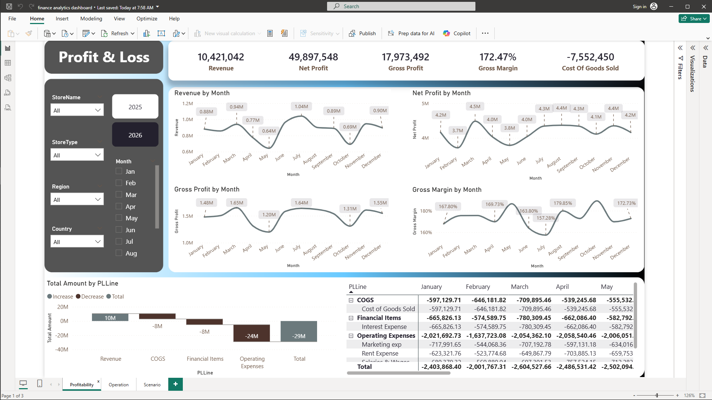
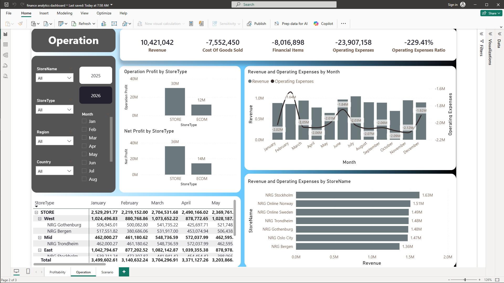

# 📊 Finance Analytics Project — Nordic Retail Group

## 🎯 Project Overview

This project analyzes the financial performance of Nordic Retail Group to evaluate profitability, operational efficiency, and business risk. Despite strong revenue and gross margins, the company faces challenges in achieving sustainable profitability due to high operating expenses and structural inefficiencies.

---

## 📸 Dashboard Preview

### 🔹 Profitability Dashboard

Displays Net Profit trends, Gross Margin, and overall financial performance over time.

---

### 🔹 Operational Dashboard

Shows the relationship between Revenue and Operating Expenses to evaluate cost efficiency.

---

### 🔹 Scenario Analysis Dashboard

Compares Actual vs Best Case vs Worst Case to assess business risk and potential outcomes.

---

## ❓ Business Problem

The company is generating consistent revenue but struggling to convert it into profit. Key questions addressed:

- Is the company becoming more profitable over time?
- Are operating expenses aligned with revenue performance?
- What are the risks under different business scenarios?

---

## 📊 Key Analysis

- **Profitability Analysis** → Net Profit trend and margin evaluation
- **Operational Analysis** → Revenue vs Operating Expenses efficiency
- **Store Performance** → Comparison across locations and channels
- **Scenario Analysis** → Actual vs Best vs Worst case performance

---

## 🔍 Key Insights

- Profitability is **stable but not improving significantly**
- Operating expenses are **consistently high and inefficient**
- Physical stores outperform e-commerce significantly
- A **~17% gap to Best Case** indicates structural inefficiencies

---

## 🚀 Recommendations

- Optimize operating costs (logistics & marketing)
- Improve operational efficiency across stores
- Strengthen underperforming channels (e-commerce)
- Use scenario-based planning to reduce financial risk

---

## 📈 Outcome

This project provides **data-driven insights and actionable strategies** to help the company improve cost efficiency, align operations with revenue, and achieve sustainable profitability.

---

## 🛠️ Tools & Technologies

- SQL (data processing)
- Python (analysis)
- Power BI (dashboard visualization)

---

## 📁 Project Structure
